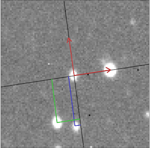

# StarMatch
Coordinates transformation library and script for reduced FITS files (dedicated for daophot format files)

**22.01.2023**  
**Marek Gorski and Dominika Switlik** 

### Reguirements:
*python3, numpy 


### Run:

```console
./starmatch_cl.py reference.ap field.ap 
```
**or**  

```./starmatch_cl.py pixscale=2.3 starratio=0.7 reference.ap field.out```  #  mark point  

### Basic description 

bla bla **thumbnail** and *adds* bla bla


### Library

```
from FitsView_gui import * # load FitsView class to Your script 
cfg=["x_Col=1","y_Col=2"] # set up desired configuration. 
FV_window = FitsView(cfg) # run the Pymage Widget class 
FV_window.fname="plik.fits" # define FITS file name 
FV_window.newFits() # execute new fits 
FV_window.show() 
```


### Algorithm description




reference x,y projection star1: -0.13465263,-1.34699033
reference x,y projection star2: -0.13465263,-1.34699033

field x,y projection star2: -0.61142403, -1.17670621
field x,y projection star2: -0.62199523,  -1.18319083


`cp FitsView* .` # copy FitsView files to working directory 


#### Issues & ToDo:

*  Implement small number of stars
