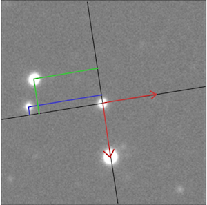
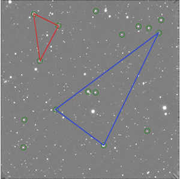
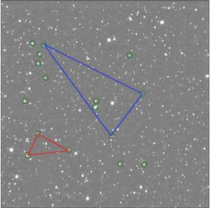

# StarMatch

**22.01.2023**  
**Marek Gorski and Dominika Switlik** 

Coordinates transformation library and comand line script for reduced FITS files (dedicated for daophot format files). 
Transformation of 2nd order (translation, rotation, scaling and distortion). Please be advised: some random star selection is used. 

#### Reguirements:
python3, numpy 


### Run:

```console
./starmatch_cl.py reference.ap field.ap 
```
**or**  
```console
./starmatch_cl.py pixscale=2.3 starratio=0.7 reference.ap field.out
```

### Basic description 
Script for finding transformation coefficients (2nd-order) of coordinates from field to reference and back. Script needs x,y coordinates and magnitudes (for sorting and selection purpose). Scripts reads standard daophot files, and simple text files with x,y columns in the 1st and 2nd column. Script creates **field.xytr** file with coefficients with description. 

**pixscale** - field / reference ratio of pixelscale. HAWKI/SOFI = 0.3680

**starratio** - ratio of the average number of stars for magnitude range of field/reference. HAWKI(1 CHIP)/SOFI = 0.58

Script works in three steps: 
* In the first step, for brightests stars in the field and reference frame, **local featurers** are recognised and compared. 
It creates a list of stars with most similar features. 
* In the second step, the list of stars with similar features are verified wih **triangles algorithm** 
* In the last step, the coordinates transformation is calculated as the 3-order polynomial. 

Transformation coefficients are saved in the **field.xytr** file, where coefficients are specified:

 x' = px[0] + px[1] * x + px[2] * y + px[3] * x*y + px[4] * x*x + px[5] * y*y
 
 y' = py[0] + py[1] * x + py[2] * y + py[3] * x*y + py[4] * x*x + py[5] * y*y
 

### Library

#### EXAMPLE:
```
 from starmatch_lib import *
  
 sm=StarMatch()
 sm.loud=True               # print messages on terminal
 sm.nb_use=400              # use 400 brightests stars for feature calculation
 sm.fieldStarsRatio=0.58    # HAWKI/SOFI starratio
 sm.pixscale=0.3680         # HAWKI/SOFI pixel scale
 sm.ref_xr=x_ref            # x cooridinates of all stars in reference frame
 sm.ref_yr=y_ref            # y cooridinates of all stars in reference frame
 sm.ref_mr=m_ref            # magnitudes of all stars in reference frame
 sm.field_xr=x_field        # x cooridinates of all stars in field frame
 sm.field_yr=y_field        # y cooridinates of all stars in field frame
 sm.field_mr=m_field        # magnitudes of all stars in field frame
 sm.go()                    # calculation
 print(sm.mssg)             # print message
```
#### Returns:
```
# sm.p_fr_x                 # X field to X reference coefficients
# sm.p_fr_y                 # Y field to Y reference coefficients
# sm.p_rf_x                 # X reference to X field coefficients
# sm.p_rf_y                 # Y reference to Y field coefficients

# sm.ref_match_x            # reference star list matched with feature recognition 
# sm.ref_match_y            # reference star list matched with feature recognition 
# sm.field_match_x          # field list stars matched with feature recognition
# sm.field_match_y          # field list stars matched with feature recognition
# sm.trainglesMatch_ref_x   # referece list with triangles match 
# sm.trainglesMatch_ref_y   # referece list with triangles match 
# sm.trainglesFail_ref_x    # reference list with traingles match fail
# sm.trainglesFail_ref_y    # reference list with traingles match fail
```
#### Fine tuning:
```
 sm.loud=False                   # print messege on terminal
 sm.nb_use=400                   # number of stars included in feature matching
 sm.nbPCent_match=0.25           # percentage of stars for which feature will be calulated
 sm.nbStarsRadius=10             # average number of stars within the radius for local feature calculation
 sm.starlist_error=0.05          # toleration for feature list comparison
 sm.min_score=0.5                # toleration for feature list comparison score 
```


### Algorithm description
First, 400 (**sm.nb_use**) brightest stars in both _field_ and _reference_ are selected. If **sm.fieldStarsRatio** parameter is not 1, in the _field_ selected will be more or less stars, accordingly to this parameter.  For 25% (**sm.nbPCent_match**) of the brightests stars feature characteristic is calculated. For this step, only stars within the specific radious are included. The radious is calculated to have on average 10 (**sm.nbStarsRadius**) stars within this radious. Radious in the _field_ is scaled according to **sm.pixscale** parameter.  

Local feature calculation: for specifeid star, the _axis1_ and _axis2_ are set up, as the vector and it's normal from specified star to the brightest local star (within radious). For other local stars, projection on axis1 and axis2 of the vectors from specified stars towards them are calculated. This creates array of projections for local stars, arranged with rising magnitude (brightest first). Projection arrays do not depend on **scale** and **rotation**, as long as the brightest star in _reference_ and _field_ is the same, and radious is properly scaled.  

 

reference (left) axis1 and axis2 projection [star1,star2]: [-0.13465263,-1.34699033], [-0.61142403,-1.17670621]

field (right) axis1 and axis2 projection [star1,star2]: [-0.13465263,-1.34699033], [-0.62199523,-1.18319083]

For each considered star in _reference_, projection arrays are compared with _field_. The best match is set up with score. Points are obtained for each element (index, index+1, index-1) of the array if projections difference is smaller than **sm.starlist_error**. Points are scaled: more points are obtained for same projection for brighter stars. 

Results are **sm.ref_match_x**, **sm.ref_match_y** and **sm.field_match_x**, **sm.field_match_y**, where for particular index we should have same stars in _reference_ and _field_. 

In the second step, those list are checked with triangle match. If traingle constructed on stars from _reference_ and _field_ are same, those stars are confirmed match. First triangle corner is just iterated from the _ref_ and _field_ lists, but two other corners of the trinagle are selected as **RANDOM** index.  

 


#### Issues & ToDo:

*  Implement small number of stars
